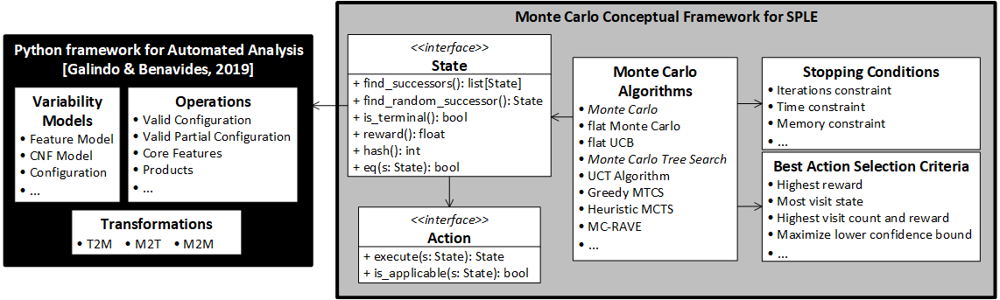
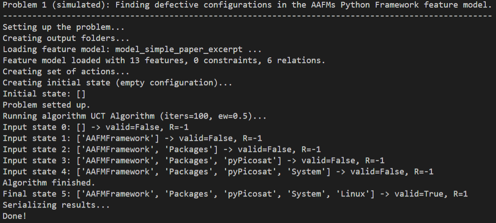
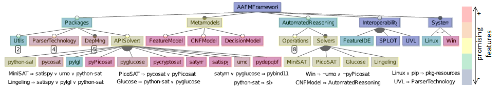

# Monte Carlo Tree Search for feature model analyses: a new framework for decision-making
This repository contains all the resources and artifacts of the paper entitled *Monte Carlo Tree Search for feature model analyses: a new framework for decision-making* submitted in the 25th International Systems and Software Product Line Conference (SPLC 2021) by the authors José Miguel Horcas, José A. Galindo, Ruben Heradio, David Fernández-Amoros, and David Benavides.

We present a [**Monte Carlo conceptual framework**](montecarlo4fms/) that allows analyzing SPL problems by modeling them as a sequence of decision-steps and solving them with Monte Carlo techniques.
The Monte Carlo framework has been developed on top of the [Python framework for automated analysis of feature models](https://github.com/diverso-lab/core) proposed by [Galindo and Benavides](https://doi.org/10.1145/3382026.3425773).
The details of the core components of the Monte Carlo framework are described [here](montecarlo4fms/README.md).

## Artifact description
This repository is organized into three parts:
1. The [**Monte Carlo conceptual framework**](montecarlo4fms/). This includes:
  - A set of interfaces to be implemented in order to model SPL problems as sequences of *(state, actions)* pairs.
  - An implementation of several Monte Carlo methods, including the Monte Carlo Tree Search (MCTS) method, ready to be used to solve any problem which implements the aforementioned interfaces.

2. Instantiations of the framework to analyze different problems. In particular we provide two concrete implementations of the *(state, actions)* interfaces:
  - An implementation of *(state, actions)* where states represent configurations of a feature model.
  - An implementation of *(state, actions)* where states represent feature models.

3. Results of the analyses performed with Monte Carlo techniques over the problems modeled.
   

## Requirements
The implementation of this conceptual framework has relied on the Python programming language. By convention all requirements are depicted in the requirements.txt file. Concretely, the dependencies are:

- [Python 3.9+](https://www.python.org/)
- [Python-sat](https://pysathq.github.io/)
- [Graphviz](https://pypi.org/project/graphviz/)

The framework has been tested in Windows and Linux and currently supports Docker as runtime enviroment. 

## Execution and experiment replication


## The Monte Carlo conceptual framework
<p align="center">
  
</p>

The framework defines the two main interfaces (*State* and *Action*) to be implemented in order to model and solve a problem with Monte Carlo methods. 
The *State* interface specifies the necessary methods to explore the whole search space, so that from a given initial state we can reach all states. 
The *State* interface has to be implemented only once defining the state transition function (`find_successors()` and `find_random_successor()`), the `is_terminal()` condition, and the `reward()` function.
The *Action* interface is defined for each applicable actions. Different Monte Carlo algorithms can be then applied. Each Monte Carlo algorithm can be configured with a stopping condition such as a time, memory, or iteration constraint, and with a selection criteria for the best action decision. For instance, to select the child with the highest reward, the most visited child, the child with both the highest visit count and the highest reward, or the child which maximizes a lower confidence bound.
The following Monte Carlo algorithms are currently available:
- **UCT Algorithm:** An implementation of MCTS that builds a search tree and uses the *upper confidence bound for trees* (UCT) selection strategy. This strategy favors actions with a higher *Q*-value but allows at the same time to explore those actions that have not yet been sufficiently explored.
- **Greedy MCTS:** A best-first strategy that favors exploitation against exploration.
- **flat Monte Carlo:** A basic Monte Carlo method with random action selection and no tree growth.

The details of the core components of the framework are described [here](montecarlo4fms/README.md).


## Analyzing problems with the Monte Carlo framework
The following use case diagram shows the four problems that have been implemented, and the output results obtained from applying Monte Carlo methods.

<p align="center">
  
</p>

To use the framework under python 3.9 you will need the folowing:
```
git clone https://github.com/diverso-lab/fm_montecarlo.git
cd fm_montecarlo
pip install -r requirements.txt
```

In case of using [Docker]('https://docs.docker.com/get-docker/'), a Dockerfile is provided and a precompiled image available at dockerhub/diversolab
To execute the commands in an interactive shell, execute:

```
    docker run -i diversolab/fm_montecarlo
```
Also, note that you will have to mount the volumes locally if you want the results to be perseved. This can be done by adding the parameter to all docker run commands:

```
-v <localdir>:/usr/src/app/output_results
```
For example
```
mkdir output
docker run -i -v $PWD/output:/usr/src/app/output_results diversolab/fm_montecarlo
```

This is similar in case of willing to use your own models. Note that in there are a set of models already available within the docker image. 
For example, you can execute  `docker run -i diversolab/fm_montecarlo python main_completion_partial_configs.py -fm input_fms/pizzas.xml -it 100 -min`


- **Configuration based analyses**
    - **Localizing defective configurations**: This problem consists in identifying the feature model configurations that lead to a given defect or some other undesired program behavior. Those defects may happen due to incompatibilities of features, anomalies or errors when the configuration is compiled, deployed or executed.

        Two real-world feature models are analyzed: the jHipster and the Python framework for AAFMs. 

        To analyze the feature model of the Python framework for AAFMs execute: `python main_localizing_defective_configs.py` or, in case of using Docker `docker run -i diversolab/fm_montecarlo python main_localizing_defective_configs.py`

        To analyze the jHipster feature model execute: `python main_jhipster_localizing_defective_configs.py` or in case of using Docker, `docker run -i diversolab/fm_montecarlo python main_jhipster_localizing_defective_configs.py`
        
        The analysis can be configured with the following parameters:

            `-it ITERATIONS`: specify the number of simulations to be executed by the Monte Carlo method (default 100).

            `-ew EXPLORATION_WEIGHT`: the exploration weight constant for MCTS to balance exploitation vs exploration (default 0.5).

            `-m METHOD`: the Monte Carlo method to be executed: "MCTS" for the UCT Algorithm (default), "Greedy" for the Greedy MCTS, and "flat" for the basic Monte Carlo method.

        Additionally, the case study of the Python framework for AAFMs can be configured to use the complete version of the feature model (default) or the excerpt version presented in the paper (using the `-e` option).

    - **Completion of partial configurations**: The completion of partial configuration problem consists of finding the set of non-selected features necessary for getting a complete valid configuration. While in a complete configuration each feature is decided to be either present or absent in the resulting configuration, in partial configurations, some features are undecided. So, given a feature model and a partial configuration, we can use Monte Carlo methods to complete the given partial configuration with valid selections. 
    
        The problem can be executed with: `python main_completion_partial_configs.py -fm feature_model -cnf cnf_model -f features`

            The `feature_model` parameters is mandatory and specifies the filepath of the feature model in FeatureIDE format.

            The `cnf_model` is optional and specifies the feature model in CNF with FeatureIDE (textual) format. This parameters is only required is the feature model have complex constraints (others than "requires" and "excludes").

            The `features` parameter is optional, it is a list of the features selection of the user representing the initial partial configuration. If not provided, the empty configuration is used by default.
    
        The analysis can be also configured with the following parameters:

            `-it ITERATIONS`: specify the number of simulations to be executed by the Monte Carlo method (default 100).

            `-ew EXPLORATION_WEIGHT`: the exploration weight constant for MCTS to balance exploitation vs exploration (default 0.5).

            `-m METHOD`: the Monte Carlo method to be executed: "MCTS" for the UCT Algorithm (default), "Greedy" for the Greedy MCTS, and "flat" for the basic Monte Carlo method.
  
    - **Minimizing valid configurations**: This problem consists in finding a valid configuration with the minimum number of features. 
    
        This problem can be executed as the previous one to complete partial configurations, but using the `-min` option to indicate that the number of feature selections must be minimized:
            
            `python main_completion_partial_configs.py -fm feature_model -cnf cnf_model -f features -min`
           
            or in case of Docker
            
            `docker run -i diversolab/fm_montecarlo python main_completion_partial_configs.py -fm feature_model -cnf cnf_model -f features -min`
            
- **Feature models based analysis**
    - **Reverse engineering of feature models**: A well-known problem in SPLs is to synthesize a feature model from a set of configurations automatically. Given a set of feature combinations present in an SPL (i.e., a set of configurations), the goal is to extract a feature model that represents all the configurations.

    The problem can be executed with: `python main_reverse_engineering_fms.py -fm feature_model -cnf cnf_model` or in case of using docker `docker run -i diversolab/fm_montecarlo python main_reverse_engineering_fms.py -fm feature_model -cnf cnf_model`

        The `feature_model` parameters is mandatory and specifies the filepath of the feature model in FeatureIDE format.

        The `cnf_model` is optional and specifies the feature model in CNF with FeatureIDE (textual) format. This parameters is only required is the feature model have complex constraints (others than "requires" and "excludes").

    We use all configurations of the given feature model as input configurations to extract a new feature model.
    
    The analysis can be also configured with the following parameters:

            `-it ITERATIONS`: specify the number of simulations to be executed by the Monte Carlo method (default 100).

            `-ew EXPLORATION_WEIGHT`: the exploration weight constant for MCTS to balance exploitation vs exploration (default 0.5).

            `-m METHOD`: the Monte Carlo method to be executed: "MCTS" for the UCT Algorithm (default), "Greedy" for the Greedy MCTS, and "flat" for the basic Monte Carlo method.

## Results
Four kinds of results are provided by the analyses:
1. The optimal solution, as well as the optimal decisions taken step by step are shown in the terminal.
<p align="center">
  
</p>

This result is shown for all type of analyses.

2. Two .csv files with statistics of the analysis are generated in the `output_results/stats` folder.
   
This result is also generated for all type of analyses.
   
3. A set of heat maps are also generated containing valuable information about each decisions made in each step. A heat map file in .csv is generated for each step in the `output_results/heatmaps` folder. The heat maps contains the normalized *Q*-value for each decision and a mapping to a warm-cold colors scale which can be used to colored a feature model. 

This result is only generated for the configuration-based analyses.

4. In the case of the reverse engineering of feature models problem the output is feature model automatically extracted (in the new UVL format); and a .log file with all the decisions taken during the process, as well as all alternative decisions considered with their normalized *Q*-values.

<p align="center">
  
</p>


## References
- [Python framework for automated analysis of feature models](https://github.com/diverso-lab/core)
