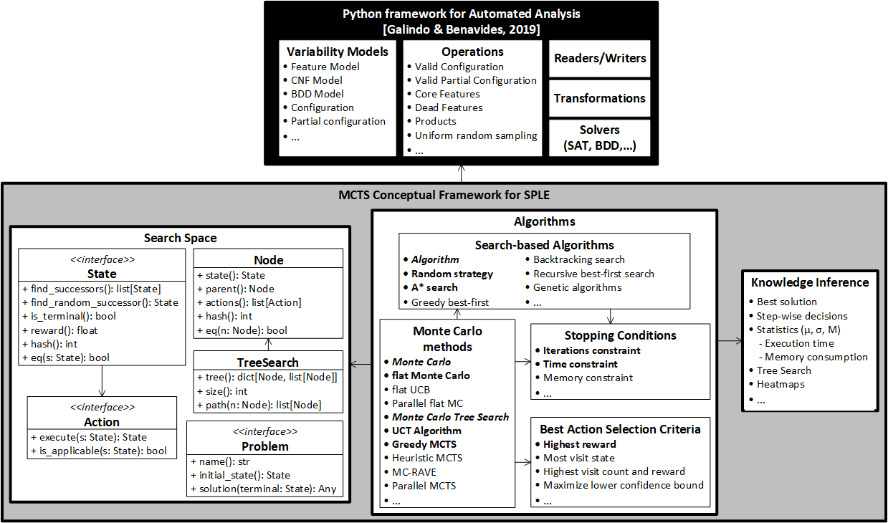
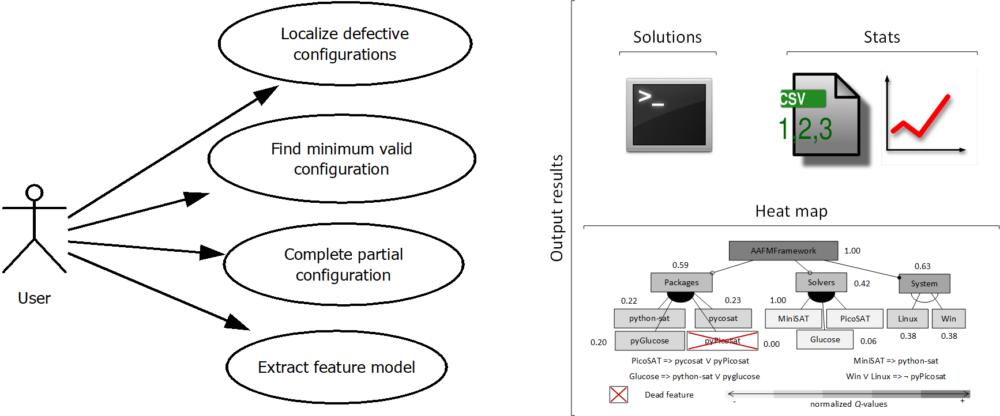

# Monte Carlo Tree Search for feature model analyses: a new framework for decision-making
This repository contains all the resources and artifacts of the paper entitled *Monte Carlo Tree Search for feature model analyses: a new framework for decision-making* submitted in the 25th International Systems and Software Product Line Conference (SPLC 2021) by the authors José Miguel Horcas, José A. Galindo, Ruben Heradio, David Fernández-Amoros, and David Benavides.

# Table of Contents
- [Artifact description](#artifact-description)
- [The Monte Carlo conceptual framework](#the-monte-carlo-conceptual-framework)
- [Installation and execution](#installation-and-execution)
    - [Requirements](#requirements)
    - [Download and setup](#download-and-setup)
    - [Using the framework under Docker](#using-the-framework-under-Docker)
- [Analyzing problems with the Monte Carlo framework](#analyzing-problems-with-the-Monte-Carlo-framework)
- [Results](#Results)
    - [Experiment replication](#experiment-replication)
      - [Replicating results from problem analyses](#replicating-results-from-problem-analyses)
      - [Replicating results from comparison of Monte Carlo methods](#replicating-results-from-comparison-of-Monte-Carlo-methods)
    - [Note about randomness in Monte Carlo methods](#note-about-randomness-in-Monte-Carlo-methods)
- [References](#References)

## Artifact description
We present a [**Monte Carlo conceptual framework**](montecarlo4fms/) to analyze SPL problems by modeling them as a sequence of decision steps and solving them with Monte Carlo techniques.
The Monte Carlo framework has been developed on top of the [Python framework for automated analysis of feature models](https://github.com/diverso-lab/core) proposed by [Galindo and Benavides](https://doi.org/10.1145/3382026.3425773).
The details of the core components of the Monte Carlo framework are described [here](montecarlo4fms/README.md).

This repository is organized into three parts:
1. The [**Monte Carlo conceptual framework**](montecarlo4fms/). This includes:
  - A set of interfaces to be implemented in order to model SPL problems as sequences of *(state, actions)* pairs.
  - An implementation of several Monte Carlo methods, including the Monte Carlo Tree Search (MCTS) method, ready to be used to solve any problem that implements the aforementioned interfaces.

2. Instantiations of the framework to analyze different problems. In particular, we provide two concrete implementations of the *(state, actions)* interfaces:
  - An implementation of *(state, actions)*, where states represent configurations of a feature model.
  - An implementation of *(state, actions)*, where states represent feature models.

3. Results of the analyses performed with Monte Carlo techniques over the problems modeled.
   

## The Monte Carlo conceptual framework
<p align="center">
  
</p>

The framework defines the two main interfaces (*State* and *Action*) to be implemented in order to model and solve a problem with Monte Carlo methods. 
The *State* interface specifies the necessary methods to explore the whole search space so that from a given initial state, we can reach all states. 
The *State* interface has to be implemented only once by defining the state transition function (`find_successors()` and `find_random_successor()`), the `is_terminal()` condition, and the `reward()` function.
The *Action* interface is defined for each applicable action. Different Monte Carlo algorithms can then be applied. Each Monte Carlo algorithm can be configured with a stopping condition (such as a time, memory, or iteration constraints) and with a selection criteria for the best action decision. For instance, to select the child with the highest reward, the most visited child, the child with both the highest visit count and the highest reward, or the child which maximizes a lower confidence bound.
The following Monte Carlo algorithms are currently available:
- **UCT Algorithm:** An implementation of MCTS that builds a search tree and uses the *upper confidence bound for trees* (UCT) selection strategy. This strategy favors actions with a higher *Q*-value but allows at the same time to explore those actions that have not yet been sufficiently explored.
- **Greedy MCTS:** A best-first strategy that favors exploitation against exploration.
- **flat Monte Carlo:** A basic Monte Carlo method with random action selection and no tree growth.

The details of the core components of the framework are described [here](montecarlo4fms/README.md).

## Installation and execution

### Requirements
The implementation of this conceptual framework has relied on the Python programming language. By convention, all requirements are depicted in the requirements.txt file. In particular, the dependencies are:

- [Python 3.9+](https://www.python.org/)
- [Python-sat](https://pysathq.github.io/)
- [Graphviz](https://pypi.org/project/graphviz/)

The framework has been tested in Linux, but Windows is also supported using Docker as runtime environment (see below). 

### Download and setup
To use the framework under Python 3.9, you will need the following:
```
git clone https://github.com/diverso-lab/fm_montecarlo.git
cd fm_montecarlo
```

At this point, it is recommended to use a virtual environment:

Create the virtual environment: `python -m venv env`

Activate the environment (Linux): `source env/bin/activate`

Activate the environment (Windows): `.\env\Scripts\Activate`

Finally, install the dependencies: `pip install -r requirements.txt`


### Using the framework under Docker
Alternatively, in the case of using [Docker]('https://docs.docker.com/get-docker/'), a Dockerfile is provided and a precompiled image is available at [dockerhub/diversolab](https://hub.docker.com/r/diversolab/fm_montecarlo) 

To remove any previous version, run:
```
diversolab/fm_montecarlo
```
To execute the commands in an interactive shell, run:

```
    docker run -i diversolab/fm_montecarlo
```
Also, note that you will have to mount the volumes locally if you want the results to be persistent. This can be done by adding the parameter to all docker run commands:
```
-v <localdir>:/usr/src/app/output_results
```
For example:
```
mkdir output
docker run -i -v $PWD/output:/usr/src/app/output_results diversolab/fm_montecarlo
```

This is similar to the case of willing to use your own models. Note that there is a set of models already available within the docker image. 
For example, you can execute: 

`docker run -i diversolab/fm_montecarlo python main_completion_partial_configs.py -fm input_fms/pizzas.xml -it 100 -min`

(see the following section for further details)

## Analyzing problems with the Monte Carlo framework
The following use case diagram shows the four problems that have been implemented, and the output results obtained from applying Monte Carlo methods.

<p align="center">
  
</p>


- **Configuration based analyses**
    - **Localizing defective configurations**: This problem consists in identifying the feature model configurations that lead to a given defect or to some other undesired program behaviors. Those defects may happen due to incompatibilities of features, anomalies or errors when the configuration is compiled, deployed or executed. Two real-world feature models are analyzed: the jHipster and the Python framework for AAFMs. 

      To analyze the feature model of the Python framework for AAFMs, execute: 
      
      `python main_localizing_defective_configs.py` 
        
      or, in the case of using Docker: 
      
      `docker run -i diversolab/fm_montecarlo python main_localizing_defective_configs.py`

      To analyze the jHipster feature model, run: 
      
      `python main_jhipster_localizing_defective_configs.py` 
          
      or in the case of using Docker: 
      
      `docker run -i diversolab/fm_montecarlo python main_jhipster_localizing_defective_configs.py`
      
      The analysis can be configured with the following parameters:

      `-it ITERATIONS`: specifies the number of simulations to be executed by the Monte Carlo method (default 100).

      `-ew EXPLORATION_WEIGHT`: the exploration weight constant for MCTS to balance exploitation vs. exploration (default 0.5).

      `-m METHOD`: the Monte Carlo method to be executed: "MCTS" for the UCT Algorithm (default), "Greedy" for the Greedy MCTS, and "flat" for the basic Monte Carlo method.

      Additionally, the case study of the Python framework for AAFMs can be configured to use the complete version of the feature model (default) or the excerpt version presented in the paper (using the `-e` option).

      - **Completion of partial configurations**: The problem of completing partial configurations deals with finding the set of non-selected features necessary for getting a complete valid configuration. While in a complete configurationk, each feature is decided to be either present or absent, in partial configurations, some features are undecided. So, given a feature model and a partial configuration, we can use Monte Carlo methods to complete the given partial configuration with valid selections. 
    
      The problem can be executed with: 
      
      `python main_completion_partial_configs.py -fm feature_model -cnf cnf_model -f features`

      The `feature_model` parameter is mandatory and specifies the file path of the feature model in FeatureIDE format.

      The `cnf_model` is optional and specifies the feature model in CNF with FeatureIDE (textual) format. This parameter is only required if the feature model has complex constraints (others than "requires" and "excludes").
  
      The `features` parameter is optional. It is a list of the user's feature selection that represents the initial partial configuration. If it is not provided, the empty configuration is used by default.

      In the case of using Docker, the parameters can be provided as in the following example:

      `docker run -i diversolab/fm_montecarlo python main_completion_partial_configs.py -fm input_fms/pizzas.xml -it 100 -min`

  
      The analysis can also be configured with the following parameters:

      `-it ITERATIONS`: specifies the number of simulations to be executed by the Monte Carlo method (default 100).

      `-ew EXPLORATION_WEIGHT`: the exploration weight constant for MCTS to balance exploitation vs. exploration (default 0.5).

      `-m METHOD`: the Monte Carlo method to be executed: "MCTS" for the UCT Algorithm (default), "Greedy" for the Greedy MCTS, and "flat" for the basic Monte Carlo method.

    - **Minimizing valid configurations**: This problem consists in finding a valid configuration with the minimum number of features. 
    
      This problem can be executed as the previous one to complete partial configurations, but using the `-min` option to indicate that the number of feature selections must be minimized:
          
      `python main_completion_partial_configs.py -fm feature_model -cnf cnf_model -f features -min`
          
      or in the case of using Docker:
          
      `docker run -i diversolab/fm_montecarlo python main_completion_partial_configs.py -fm feature_model -cnf cnf_model -f features -min`
            
- **Feature models based analysis**
    - **Reverse engineering of feature models**: A well-known problem in SPLs is to synthesize a feature model from a set of configurations automatically. Given a set of feature combinations present in a SPL (i.e., a set of configurations), the goal is to extract a feature model representing all the configurations.
      The problem can be executed with: 
    
      `python main_reverse_engineering_fms.py -fm feature_model -cnf cnf_model` 
          
      or in the case of using Docker:
      
      `docker run -i diversolab/fm_montecarlo python main_reverse_engineering_fms.py -fm feature_model -cnf cnf_model`

      The `feature_model` parameter is mandatory and specifies the file path of the feature model in FeatureIDE format.
      
      The `cnf_model` is optional and specifies the feature model in CNF with FeatureIDE (textual) format. This parameter is only required when the feature model has complex constraints (others than "requires" and "excludes").

      We use all configurations of the given feature model as input configurations to extract a new feature model.
      
      The analysis can also be configured with the following parameters:

      `-it ITERATIONS`: specifies the number of simulations to be executed by the Monte Carlo method (default 100).

      `-ew EXPLORATION_WEIGHT`: the exploration weight constant for MCTS to balance exploitation vs. exploration (default 0.5).

      `-m METHOD`: the Monte Carlo method to be executed: "MCTS" for the UCT Algorithm (default), "Greedy" for the Greedy MCTS, and "flat" for the basic Monte Carlo method.

## Results
The analyses provide four kinds of results:
1. The optimal solution and the partially optimal decisions made step by step are shown in the terminal.
<p align="center">
  
</p>

This result is shown for all types of analyses.

2. Two .csv files with statistics of the analysis are generated in the `output_results/stats` folder.
   
This result is also generated for all types of analyses.
   
3. A set of heat maps are also generated containing valuable information about each decision made in each step. A heat map file in .csv is generated for each step in the `output_results/heatmaps` folder. The heat maps contain the normalized *Q*-value for each decision and a mapping to a warm-cold colors scale which can be used to color a feature model. 

This result is only generated for the configuration-based analyses using the Monte Carlo Tree Search method or one of its variants that builds a search-tree (i.e., the heatmaps are not generated for flat Monte Carlo).

4. In the problem of the reverse engineering feature models, the output is a feature model automatically extracted (in the new UVL format); and a .log file with all the decisions taken during the process, as well as all alternative decisions considered with their normalized *Q*-values.

<p align="center">
  
</p>

### Experiment replication
The results from the paper are available in the [Results](https://github.com/diverso-lab/fm_montecarlo/tree/main/results) folder.
It is worthy to highlight that there are two types of experiments: (1) those about the problem analyses previously presented, and (2) experiments to compare Monte Carlo methods used in the evaluation.
Here we explain how to replicate both experiments using the Python scripts provided.

In order to allow replicating the results, we have added an optional parameter `-s SEED` in all experiments (analyses and comparison) to set up the random seed. 
  
  `-s SEED`: the seed to be used for the random module to replicate the experiments (default None).
  
To obtain the same results, use the seed `2021` in all cases.

*Note:* despite setting up the random seed used by the Monte Carlo methods, some results may present slight variations due to the inherent randomness nature of the Monte Carlo methods (see note about the randomness of Monte Carlo methods at the end of this file for more details).

#### Replicating results from problem analyses
To replicate these experiments, execute the analyses with the following parameters:

- Localizing defective configurations (results [here](https://github.com/diverso-lab/fm_montecarlo/tree/main/results/problems%20analyses/problem1_localizing_defective_configs)):
    - For the AAFMs Python Framework feature model (excerpt version):
  
      `python main_localizing_defective_configs.py -e -it 100 -s 2021 -m MCTS`
    
    Change the `-m` parameter to `flat` for the flat Monte Carlo method, and `Greedy` for the Greedy MCTS.

    - For the AAFMs Python Framework feature model (complete version), use the same command but without the `-e` parameter:
  
      `python main_localizing_defective_configs.py -it 100 -s 2021 -m MCTS` 
    
    Change the `-m` parameter to `flat` for the flat Monte Carlo method, and `Greedy` for the Greedy MCTS.

    - For the jHipster feature model:
  
      `python main_jhipster_localizing_defective_configs.py -it 100 -s 2021 -m MCTS`
    
    Change the `-m` parameter to `flat` for the flat Monte Carlo method, and `Greedy` for the Greedy MCTS.

- Completion of partial configurations (results [here](https://github.com/diverso-lab/fm_montecarlo/tree/main/results/problems%20analyses/problem2_completion_partial_configs)):

  - For the AAFMs Python Framework feature model (excerpt version):
  
      `python main_completion_partial_configs.py -fm evaluation/aafmsPythonFramework/model_simple_paper_excerpt.xml -cnf evaluation/aafmsPythonFramework/model_simple_paper_excerpt-cnf.txt -it 100 -s 2021 -m MCTS`
    
    Change the `-m` parameter to `flat` for the flat Monte Carlo method, and `Greedy` for the Greedy MCTS.

    - For the AAFMs Python Framework feature model (complete version):
  
      `python main_completion_partial_configs.py -fm evaluation/aafmsPythonFramework/model_paper.xml -cnf evaluation/aafmsPythonFramework/model_paper-cnf.txt -it 100 -s 2021 -m MCTS` 
    
    Change the `-m` parameter to `flat` for the flat Monte Carlo method, and `Greedy` for the Greedy MCTS.

    - For the jHipster feature model:
  
      `python main_completion_partial_configs.py -fm evaluation/jhipster/fm-3.6.1refined.xml -cnf evaluation/jhipster/fm-3.6.1refined-cnf.txt -it 100 -s 2021 -m MCTS`
    
    Change the `-m` parameter to `flat` for the flat Monte Carlo method, and `Greedy` for the Greedy MCTS.
    
    - Minimizing valid configurations (results [here](https://github.com/diverso-lab/fm_montecarlo/tree/main/results/problems%20analyses/problem3_minimizing_valid_configs)):
      The commands are the same as the previous problem but using the option `-min` activated.

      - For the AAFMs Python Framework feature model (excerpt version):
      
          `python main_completion_partial_configs.py -fm evaluation/aafmsPythonFramework/model_simple_paper_excerpt.xml -cnf evaluation/aafmsPythonFramework/model_simple_paper_excerpt-cnf.txt -it 100 -s 2021 -min -m MCTS`
        
        Change the `-m` parameter to `flat` for the flat Monte Carlo method, and `Greedy` for the Greedy MCTS.

        - For the AAFMs Python Framework feature model (complete version):
      
        `python main_completion_partial_configs.py -fm evaluation/aafmsPythonFramework/model_paper.xml -cnf evaluation/aafmsPythonFramework/model_paper-cnf.txt -it 100 -s 2021 -min -m MCTS` 
        
        Change the `-m` parameter to `flat` for the flat Monte Carlo method, and `Greedy` for the Greedy MCTS.

        - For the jHipster feature model:
      
        `python main_completion_partial_configs.py -fm evaluation/jhipster/fm-3.6.1refined.xml -cnf evaluation/jhipster/fm-3.6.1refined-cnf.txt -it 100 -s 2021 -min -m MCTS`
        
        Change the `-m` parameter to `flat` for the flat Monte Carlo method, and `Greedy` for the Greedy MCTS.

    - Reverse engineering of feature models (results [here](https://github.com/diverso-lab/fm_montecarlo/tree/main/results/problems%20analyses/problem4_reverse_engineering_fms/model1_AAFMs_excerpt)):
      For this problem, due to the size of the problem, only the excerpt version of the AAFMs Python Framework is used. Even though, as explained in the paper, this can take a while (around 10-15 min) for 1000 iterations because 1000 feature models are generated in each decision, and all configurations of those feature models are also generated to evaluate the fitness function.
      
        `python main_reverse_engineering_fms.py -fm evaluation/aafmsPythonFramework/model_simple_paper_excerpt.xml -cnf evaluation/aafmsPythonFramework/model_simple_paper_excerpt-cnf.txt -it 1000 -s 2021 -m MCTS`
        
        Change the `-m` parameter to `flat` for the flat Monte Carlo method, and `Greedy` for the Greedy MCTS.

    #### Replicating results from the comparison of Monte Carlo methods
    The evaluation experiment compares the different Monte Carlo methods over the problem of finding defective configurations in both the AAFMs Python Framework and the jHipster feature models.
    Results are available [here](https://github.com/diverso-lab/fm_montecarlo/tree/main/results/evaluation%20comparison).
    To replicate the experiments of the evaluation, we provide the following scripts that can be executed as follows:

    - For the AAFMs Python Framework feature model):
      
        `python main_comparison_aafm.py -it 1000 -s 2021 -m MCTS`

        Note that the `-it ITERATIONS` parameter is the maximum number of iterations/simulations to be performed (5000 default). 
        The script will run the Monte Carlo methods from 1 to ITERATIONS with a step of 250 iterations.
        
        *Note*: Setting up the random seed, the execution can take a while (around 1 hour for each experiment), so be patient. For impatients, we also present additional results for a small-quick comparison using the `-e` option for the excerpt version of the model.
        To understand this, read the final note at the end of this document.

        Change the `-m` parameter to `flat` for the flat Monte Carlo method, `Greedy` for the Greedy MCTS, and `random` for Random Sampling. For the Random Sampling, in the case of using the complete version of the feature model (10e9 configurations) or other large-scale feature models, you need to use the [BDDSampler](https://github.com/davidfa71/BDDSampler) by Heradio et al. The integration of BDDSampler within our framework is out of the scope of this work. Thus, there is no script at this moment to automate the random sampling results from the BDDSampler. In the case of using the excerpt version (`-e` parameter), the maximum number of iterations is equal to the maximum number of configurations of the feature model.

    - For the jHipster feature model):

        `python main_comparison_jhipster.py -it 1000 -s 2021 -m MCTS`

        Use the same parameters and comments as the previous script hold. However, the Random Sampling strategy can be directly used for the jHipster feature model because all configurations are available.


    ### Note about randomness in Monte Carlo methods
    The underlying principle of operation of Monte Carlo methods is to use randomness to solve problems.
    Our framework relies on the Python [`random`](https://docs.python.org/3/library/random.html#module-random) module, concretely we use the `choice`, `shuffle`, and `sample` methods to implement the *selection* and *simulation* steps of the MCTS method, as well as the possible successors of the *states* and possible *actions* of the problems.
    To provide reproducibility in our framework, we use a random *seed* initialized at the beginning of the experiment.

    However, the `random` module is not the only source of randomness in our framework. The MCTS method highly works with data structures (e.g., the search tree) that do not maintain the order of the states (e.g., sets, maps, or dictionaries). For instance, in a configuration of a feature model, the order of the features is irrelevant.
    Using those structures does not guarantee obtaining identical results when using methods like `random.choice`.
    Moreover, states in our framework can represent features, configurations of the feature model, or even feature models like in the reverse engineering problem. Maintaining a total order for those concepts is not straightforward. For example, defining when a feature model is lesser than others is not trivial. This change also impacts, and significatively degrades the performance of the solution because it requires continuously sorting the collections or using inefficient sorted data structures, which Monte Carlo methods do not really need. That is, there is an important trade-off between performance and reproducibility when dealing with Monte Carlo methods and randomness that should be considered.

    To alleviate these issues and provide maximum reproducibility, we have modified our framework to use *sorted* data structures in all cases, defining when necessary a total order between the states.
    Despite this, some experiments can still present a slight variation. This is due to draws in the sorted elements (e.g., features with the same names).
    However, these variations do not affect the overall results and conclusions of our research.

    ## References
    - [Python framework for automated analysis of feature models](https://github.com/diverso-lab/core)
    - [JHipster](https://github.com/jhipster)
    - [BDDSampler for Random Sampling](https://github.com/davidfa71/BDDSampler)

